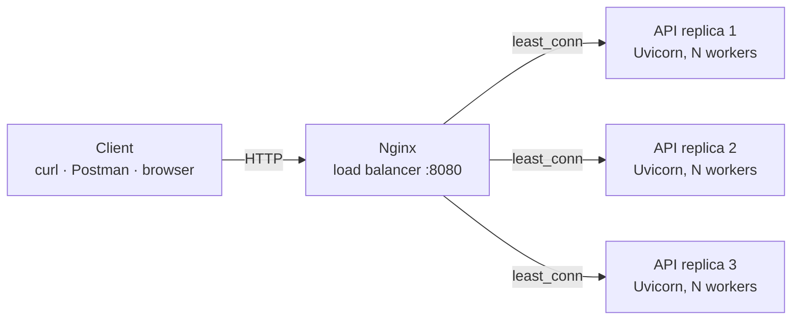

# Scalable Image Intake API

Production-ready FastAPI service that accepts `base64-encoded images`, validates and verifies them, and demonstrates horizontal scaling through multiple worker processes and load-balanced container replicas.

| | |
|---|---|
| **Live API** | [https://image-intake-api.onrender.com](https://image-intake-api.onrender.com) |
| **Source** | [github.com/midaksh/image-intake-api](https://github.com/midaksh/image-intake-api) |

---

## Table of contents

- [Overview](#overview)
- [Architecture](#architecture)
- [Features](#features)
- [API reference](#api-reference)
- [Quick start](#quick-start)
- [Configuration](#configuration)
- [Deployment](#deployment)
- [Testing](#testing)
- [Resources](#resources)

---

## Overview

Given a base64-encoded image, the service normalizes the payload (including data-URL prefixes), enforces size limits at three layers, decodes and verifies it's a genuine image using Pillow, and returns a consistent JSON response — logged with structured, request-scoped JSON logs.

| | |
|---|---|
| **Runtime** | Python 3.12, FastAPI, Uvicorn |
| **Image validation** | Pillow (decode, verify, decompression-bomb guard) |
| **Scaling** | Multi-worker Uvicorn processes + multi-instance Docker Compose behind Nginx |

---

## Architecture

### System design



Stateless request handling · request-scoped IDs propagated via `X-Request-ID` · body-size enforcement at Nginx, middleware, and application layers · each replica logs structured JSON including its own PID, proving independent process handling under load.

---

## Features

### Must-have requirements

| Requirement | How this project delivers it |
|-------------|------------------------------|
| **FastAPI server with one POST endpoint** | `POST /` accepts `{ "image": "<base64>" }` |
| **Returns confirmation on accept** | `{ "message": "accepted" }` on success |
| **Accept multiple simultaneous requests** | Async request handling; proven via `test_concurrent.py` firing concurrent requests and sampling distinct PIDs |
| **Spin up worker nodes** | `run.sh` — single instance, multiple Uvicorn worker processes (`--workers`) |
| **Run multiple instances of the server** | `docker-compose.yml` — three containerized replicas behind an Nginx load balancer (`least_conn`) |

---

### Additional features added (beyond requirements)

| # | Feature | Detail |
|---|---------|--------|
| 1 | **Real image verification** | Decodes base64, then uses Pillow `verify()` + reload to confirm genuine image bytes, not just valid base64 |
| 2 | **Data-URL support** | Accepts both raw base64 and `data:image/png;base64,...` prefixed payloads |
| 3 | **Three-layer size limits** | Nginx `client_max_body_size`, middleware content-length/body check, and decoded-image byte cap |
| 4 | **Decompression-bomb protection** | Rejects images crafted to expand to huge pixel dimensions from a tiny file |
| 5 | **Structured JSON logging** | Every request logs `request_id`, `method`, `path`, `status`, `duration_ms`, and `pid` |
| 6 | **Request tracing** | `X-Request-ID` header generated or propagated on every response |
| 7 | **Consistent error contract** | All errors return `{ "error": { "code", "message", "details?" } }` |
| 8 | **Dockerized, horizontally scalable** | `Dockerfile` + `docker-compose.yml` with health-checked replicas |
| 9 | **Automated test suite** | 15 pytest cases covering valid images, corrupt payloads, oversized requests, decompression bombs, and more |
| 10 | **Concurrency proof script** | `test_concurrent.py` fires N parallel requests and reports status distribution + sampled PIDs |
| 11 | **Production deploy** | Render (Docker-native web service) |

---

## API reference

**Production base URL:** `https://image-intake-api.onrender.com`

| Method | Path | Description |
|--------|------|-------------|
| `POST` | `/` | Accepts `{ "image": "<base64>" }`, validates, returns `{ "message": "accepted" }` |
| `GET` | `/health` | Liveness check — returns `{ "status": "ok", "pid": <int> }` |

### Example requests

```bash
# Health
curl https://image-intake-api.onrender.com/health

# Accept a valid image
curl -X POST https://image-intake-api.onrender.com/ \
  -H "Content-Type: application/json" \
  -d "{\"image\": \"$(base64 -i photo.png)\"}"

# Rejects invalid/corrupt payloads
curl -X POST https://image-intake-api.onrender.com/ \
  -H "Content-Type: application/json" \
  -d '{"image": "not-valid-base64"}'
```

### Error response shape

```json
{
  "error": {
    "code": "invalid_image",
    "message": "Payload is not a valid image"
  }
}
```

| Code | HTTP status | Meaning |
|------|-------------|---------|
| `validation_error` | 422 | Missing or malformed request body |
| `invalid_image` | 400 | Base64 decodes, but isn't a valid image |
| `payload_too_large` | 413 | Base64 string, request body, or decoded image exceeds configured limits |
| `internal_error` | 500 | Unhandled server error |

---

## Quick start

**Requirements:**
Python 3.12+ · Docker (for multi-instance mode)

```bash
git clone https://github.com/<your-username>/image-intake-api.git
cd image-intake-api
python3 -m venv venv
source venv/bin/activate
pip install -r requirements.txt
uvicorn app:app --reload --port 8000
```

Confirm: [http://127.0.0.1:8000/health](http://127.0.0.1:8000/health) → `{"status": "ok", "pid": <int>}`

---

## How to test and run

### 1. Run locally (single process)

```bash
git clone https://github.com/midaksh/image-intake-api.git
cd image-intake-api
python3 -m venv venv
source venv/bin/activate
pip install -r requirements.txt
uvicorn app:app --reload --port 8000
```

```bash
curl -s http://127.0.0.1:8000/health | python3 -m json.tool
# {"status": "ok", "pid": <int>}

curl -X POST http://127.0.0.1:8000/ \
  -H "Content-Type: application/json" \
  -d "{\"image\": \"$(base64 -i photo.png)\"}"
# {"message": "accepted"}
```

### 2. Run automated tests

```bash
pytest -v
```

15 tests cover valid PNG/JPEG uploads, data-URL payloads, corrupt bytes, invalid base64, missing fields, oversized payloads at every layer, and decompression bombs.

### 3. Run with multiple worker processes (single instance)

```bash
WORKERS=4 ./run.sh
```

```bash
for i in $(seq 1 10); do
  curl -s http://127.0.0.1:8000/health | python3 -c "import json,sys; print(json.load(sys.stdin)['pid'])"
done
```

Distinct `pid` values across calls confirm requests are being served by different worker processes.

### 4. Run multiple instances behind a load balancer

```bash
docker compose up --build
docker compose ps   # confirm api-1, api-2, api-3 all report healthy
```

```bash
for i in $(seq 1 15); do
  curl -s http://localhost:8080/health | python3 -c "import json,sys; print(json.load(sys.stdin)['pid'])"
done
```

A spread of PIDs across the sample confirms Nginx is distributing traffic across all three replicas.

### 5. Prove concurrency under load

```bash
python3 test_concurrent.py --url http://localhost:8080/ --n 100
```

Fires 100 concurrent POST requests and reports the status-code distribution plus sampled PIDs from `/health` — direct evidence the system handles simultaneous requests across multiple processes rather than serially through one.

### Configuration reference

| Variable | Default | Description |
|----------|---------|--------------|
| `HOST` | `0.0.0.0` | Bind address |
| `PORT` | `8000` | Bind port |
| `WORKERS` | `2` | Uvicorn worker processes per instance |
| `MAX_IMAGE_BYTES` | `8388608` (8 MiB) | Max decoded image size |
| `MAX_BASE64_CHARS` | derived from `MAX_IMAGE_BYTES` | Max base64 string length |
| `MAX_REQUEST_BYTES` | derived from `MAX_BASE64_CHARS` | Max total request body size |

---

## Deployment

| Service | Platform | Notes |
|---------|----------|-------|
| API | [Render](https://render.com) | Docker-native Web Service, free tier |
| Scaling demo | Local Docker Compose | 3 replicas + Nginx, not run on free-tier hosting |

```text
Build:  Dockerfile (auto-detected)
Start:  uvicorn app:app --host 0.0.0.0 --port $PORT --workers $WORKERS
```

> The live deployment runs as a single Render service. The multi-instance, load-balanced architecture — the actual answer to "how do you run multiple server instances" — is demonstrated locally via `docker compose up --build`, which starts three replicas behind Nginx and is verified with `test_concurrent.py` (see [Testing](#testing)).

---

## Tech stack

Python · FastAPI · Uvicorn · Pillow · Docker · Docker Compose · Nginx · Pytest

---